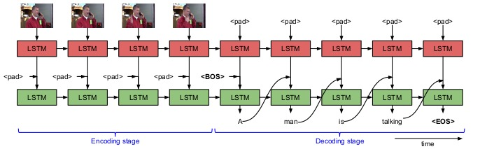

# AudioGuIA

O AudioGuia é um projeto para Video Captioning, ou seja um sistema de projetado para gerar descrições em texto a partir do conteúdo visual de um vídeo. Esse modelo utiliza Long Short-Term Memory (LSTMs), combinando técnicas de visão computacional para extrair informações visuais e processamento de linguagem natural para produzir legendas coerentes e descritivas.

Os benefícios do video captioning são diversos, incluindo a acessibilidade para pessoas com deficiência auditiva, a melhoria na indexação e busca de vídeos em plataformas digitais, o suporte à tradução automática e a criação de audiodescrição para pessoas com deficiência visual. Além disso, essa tecnologia pode ser aplicada em áreas como vigilância, educação e entretenimento, facilitando o entendimento e a análise de vídeos de forma automatizada.

---
## Sumário
* <a href="#Datasets">Datasets</a>
* <a href="#Uso">Uso</a>
* <a href="#Modelo">Modelo</a>
  * <a href="#Entrada">Entrada</a>
  * <a href="#Arquitetura">Arquitetura
  * <a href="#Métricas">Métricas</a>
* <a href="#Scripts">Scripts</a>
* <a href="#Melhorias Futuras">Melhorias Futuras</a>
* <a href="#Referências">Referências</a>


---
<h2 id="Datasets">Datasets</h2>

Para treinamento, teste e validação foram usados dois datasets reconhecidos pela literatura.

<a href="https://github.com/Soldelli/MAD">MAD</a>: MAD é um Dataset coletado de Descrições de Áudio de Filmes. Compreende um total de 384 mil frases baseadas em mais de 1,2 mil horas de vídeos contínuos de 650 filmes diferentes e diversos. Abrangendo mais de 22 gêneros em 90 anos de história do cinema, MAD cobre um amplo domínio de ações, locais e cenas.

<a href="https://www.mpi-inf.mpg.de/departments/computer-vision-and-machine-learning/research/vision-and-language/mpii-movie-description-dataset/access-to-mpii-movie-description-dataset">MPII</a>: O Dataset MPII Movie Description (MPII-MD) contém um
corpus paralelo de mais de 68 mil frases e trechos de vídeo de 94 filmes em HD, caracterizado por meio de benchmarking de diferentes abordagens para gerar descrições de vídeo.

---
<h2 id="Uso">Uso</h2>

Inicialmente é importante instalar os pacotes necessários presentes no arquivo requeriments.txt

   ```bash
   pip install -r requeriments.txt
   ```  
É importante ressaltar que não estamos autorizados a prover acesso aos datasets citados anteriormente, dessa forma a etapa de processamento e organização de dados permanecerá oculta nessa documentação.
Tendo os dados em sua versão final, basta realizar o treinamento.

   ```bash
   python3 main.py
   ```  

Para testar o modelo treinado, basta usar o arquivo de inferência ou o streamlit para apresentação.

   ```bash
   streamlit run app.py
   ``` 
ou

   ```bash
   python3 inference.py
   ```  

---
<h2 id="Modelo">Modelo</h2>

O modelo é baseado em uma arquitetura chamada S2VT (Sequence to Sequence - Video to Text), que utiliza redes neurais recorrentes (RNNs) com unidades LSTM (Long Short-Term Memory) para gerar descrições em linguagem natural a partir de sequências de vídeos. O modelo S2VT mapeia uma sequência de frames de vídeo (entrada variável) para uma sequência de palavras (saída variável).

<h3 id="Entrada">Entrada</h3>
Cada frame do vídeo é processado pelo modelo CLIP-B32 para que as informações visuais sejam resumidas vetores numéricos de 512 dimensões.

Depois do processamento dos frames, é necessário escolher quais embeddings serão entregues ao modelo, tendo em vista que existem muitos frames com informações redundantes. Dessa forma, o algortimo de clusterização k-means foi usados para agrupar frames semelhantes, por isso foi possível usar os clusters para escolher um total de 10 frames para treinamento, de forma que todas as informações da cena fossem entregues ao modelo. 

<h3 id=Arquitetura>Arquitetura</h3>

O núcleo do S2VT é uma pilha de duas camadas LSTM, como visto na figura abaixo:


*Figura 1: Arquitetura da Rede*


Primeira Camada LSTM (Encoder):

Processa os cada um dos embeddings de frames individualmente e codifica as informações temporais em uma camada latente (ℎ𝑡). Cada frame é representado pelas características do CLIP-B32 e introduzido sequencialmente na LSTM. Durante essa fase, o modelo não gera saída, apenas codifica as entradas.

Segunda Camada LSTM (Decoder):

Após todos os frames serem processados, a segunda LSTM gera a descrição palavra por palavra. O decoder recebe o estado latente da primeira LSTM e um token especial de Begin-of-Sentence para iniciar a geração. A cada passo, a LSTM prevê a próxima palavra com base no estado oculto e na palavra gerada anteriormente. O processo termina quando o token de End-of-Sentence é gerado.

---
<h2 id="Scripts">Scripts</h2>

 * **app.py** Streamlit que gera legendas para vídeos usando o modelo de captioning 
 * **dataset.py** Classe que carrega e prepara os dados para treinar o modelo de captioning
 * **inference.py** Realiza a inferência usando um modelo pré-treinado 
 * **main.py** Faz o treinamento do modelo de captioning
 * **model.py** Implementa do modelo de captioning usando a arquitetura Encoder-Decoder.
 * **utils.py** Implementa a função responsável por processar o batch de dados
 * **vocabulary.py** Define o vocabulário usadono modelo

---
<h2 id="Melhorias Futuras">Melhorias Futuras</h2>

---
<h2 id="Referências">Referências</h2>
Venugopalan et al. (2015) propuseram o modelo S2VT para geração de descrições de vídeos. Para mais detalhes, consulte o artigo:  
[Sequence to Sequence -- Video to Text](https://arxiv.org/abs/1505.00487) (arXiv:1505.00487).