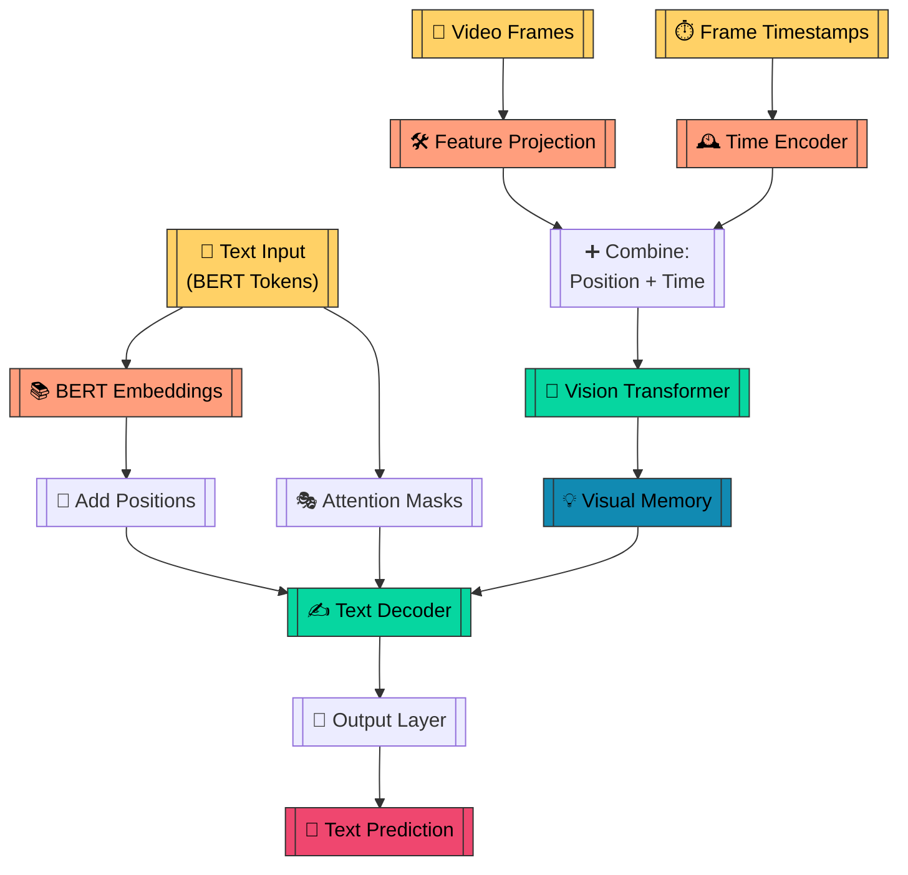

# AudioGuIA

O AudioGuia é um projeto para Video Captioning, ou seja um sistema de projetado para gerar descrições em texto a partir do conteúdo visual de um vídeo. Esse modelo combinan técnicas de visão computacional com processamento de linguagem natural para extrair informações visuais e processamento de linguagem natural para produzir legendas coerentes e descritivas.

Os benefícios do video captioning são diversos, incluindo a acessibilidade para pessoas com deficiência auditiva, a melhoria na indexação e busca de vídeos em plataformas digitais, o suporte à tradução automática e a criação de audiodescrição para pessoas com deficiência visual. Além disso, essa tecnologia pode ser aplicada em áreas como vigilância, educação e entretenimento, facilitando o entendimento e a análise de vídeos de forma automatizada.

---
## Sumário
* <a href="#Datasets">Datasets</a>
* <a href="#Uso">Uso</a>
* <a href="#Modelo">Modelo</a>
* <a href="#Scripts">Scripts</a>
* <a href="#Melhorias Futuras">Melhorias Futuras</a>
* <a href="#Referências">Referências</a>


---
<h2 id="Datasets">Datasets</h2>

Para treinamento, teste e validação foram usados dois datasets reconhecidos pela literatura.

<a href="https://github.com/Soldelli/MAD">MAD</a>: MAD é um Dataset coletado de Descrições de Áudio de Filmes. Compreende um total de 384 mil frases baseadas em mais de 1,2 mil horas de vídeos contínuos de 650 filmes diferentes e diversos. Abrangendo mais de 22 gêneros em 90 anos de história do cinema, MAD cobre um amplo domínio de ações, locais e cenas.

<a href="https://www.mpi-inf.mpg.de/departments/computer-vision-and-machine-learning/research/vision-and-language/mpii-movie-description-dataset/access-to-mpii-movie-description-dataset">MPII</a>: O Dataset MPII Movie Description (MPII-MD) contém um
corpus paralelo de mais de 68 mil frases e trechos de vídeo de 94 filmes em HD, caracterizado por meio de benchmarking de diferentes abordagens para gerar descrições de vídeo.

---
<h2 id="Uso">Uso</h2>

Inicialmente é importante instalar os pacotes necessários presentes no arquivo requeriments.txt

   ```bash
   pip install -r requeriments.txt
   ```  
É importante ressaltar que não estamos autorizados a prover acesso aos datasets citados anteriormente, dessa forma a etapa de processamento e organização de dados permanecerá oculta nessa documentação.
Além disso, é necessário instalar o modelo inglês do Spacy. 

   ```bash
  python -m spacy download en_core_web_sm
   ```  

Tendo os dados em sua versão final, basta realizar o treinamento.

   ```bash
   python3 main.py
   ```  

---
<h2 id="Modelo">Modelo</h2>

O modelo adota uma arquitetura encoder-decoder baseada em Transformers para processamento multimodal. No lado do encoder, os frames de vídeo são inicialmente projetados em um espaço latente. Em paralelo, os timestamps recebem codificação posicional para capturar relações temporais. Esses componentes são combinados e processados por um stack de 4 camadas Transformer, cada uma com 8 heads de atenção, que extrai padrões espáciotemporais e gera uma memória contextualizada dos frames.

Para a geração textual, o decoder utiliza embeddings do BERT pré-treinado, ajustados dimensionalmente por projeção linear. O módulo decoder, também organizado em 4 camadas com 8 heads de atenção, opera em dois modos: realiza auto-atenção sobre os tokens textuais e atenção cruzada com a memória visual do encoder. Máscaras causais garantem o comportamento autoregressivo durante a geração.

A saída final é produzida por uma camada linear que mapeia as representações do decoder para o espaço do vocabulário do BERT (30.522 tokens possíveis). A arquitetura destaca-se pela integração eficiente de três fluxos de informação: conteúdo visual através do encoder, contexto temporal e conhecimento linguístico do BERT, todos coordenados pelos mecanismos de atenção multi-head. A Figura 1 ilustra um fluxograma simplificado da arquitetura desenvolvida.


```mermaid
flowchart TD
    %% ===== INPUTS =====
    A[["🎥 Video Frames"]] --> B[["🛠️ Feature Projection"]]
    C[["⏱️ Frame Timestamps"]] --> D[["🕰️ Time Encoder"]]
    T[["📝 Text Input<br/>(BERT Tokens)"]] --> E[["📚 BERT Embeddings"]]
    
    %% ===== VISUAL PATH =====
    B --> F[["➕ Combine:<br/>Position + Time"]]
    D --> F
    F --> G[["🧠 Vision Transformer"]]
    G --> H[["💡 Visual Memory"]]
    
    %% ===== TEXT PATH =====
    E --> I[["📍 Add Positions"]]
    I --> J[["✍️ Text Decoder"]]
    H --> J
    J --> K[["🎯 Output Layer"]]
    K --> L[["📜 Text Prediction"]]
    
    %% ===== MASKING =====
    T --> M[["🎭 Attention Masks"]]
    M --> J
    
    %% ===== STYLES =====
    style A fill:#FFD166,stroke:#333,color:#000
    style C fill:#FFD166,stroke:#333,color:#000
    style T fill:#FFD166,stroke:#333,color:#000
    style B fill:#FF9E7D,stroke:#333,color:#000
    style D fill:#FF9E7D,stroke:#333,color:#000
    style E fill:#FF9E7D,stroke:#333,color:#000
    style G fill:#06D6A0,stroke:#333,color:#000
    style J fill:#06D6A0,stroke:#333,color:#000
    style H fill:#118AB2,stroke:#333,color:#000
    style L fill:#EF476F,stroke:#333,color:#000
```

*Figura 1: Arquitetura da Rede*

🟡 Yellow: Inputs

🟠 Orange: Pre-processing

🟢 Green: Transformers

🔵 Blue: Memory

🔴 Red: Output

---
<h2 id="Scripts">Scripts</h2>

 * **dataset.py** Classe que carrega e prepara os dados para treinar o modelo de captioning
 * **main.py** Faz o treinamento do modelo de captioning
 * **newlos.py** Implementa as funções de perda do modelo
 * **model.py** Implementa do modelo de captioning usando a arquitetura proposta
 * **train.py** Define a pipeline de treinamento

---
<h2 id="Melhorias Futuras">Melhorias Futuras</h2>

---
<h2 id="Referências">Referências</h2>
Venugopalan et al. (2015) propuseram o modelo S2VT para geração de descrições de vídeos. Para mais detalhes, consulte o artigo:  
[Sequence to Sequence -- Video to Text](https://arxiv.org/abs/1505.00487) (arXiv:1505.00487).